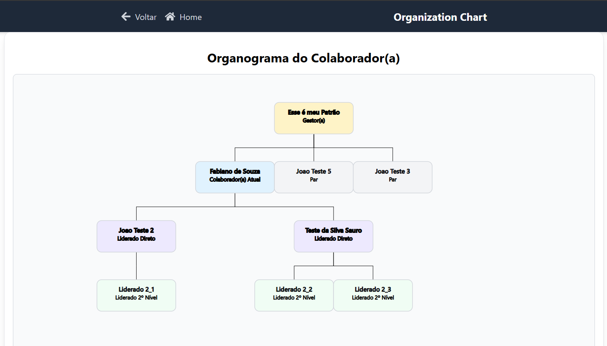

# Organizational Chart

This project is a web application for viewing and managing organizational charts, built with Ruby on Rails, React, TypeScript and PostgreSQL.

## Features
 - Company and Employee Management: Allows for the complete registration and management of companies and their employees.
 - Dynamic Organizational Chart: Generates and displays a company's organizational chart based on a specific employee's position, visualizing the hierarchy and reporting relationships.
 - Unit Tests: The application is covered by unit tests to ensure code stability and quality.
 - Simplified Local Setup: Facilitates setting up the local development environment with Makefile scripts and docker compose

## Dependencies

To run this project smoothly, make sure you have the following tools installed:

| Tool     | Description                                      | Recommended Version |
|----------|--------------------------------------------------|---------------------|
| **npm**  | Node Package Manager for installing dependencies | `>= 8.x`             |
| **Docker** | Containerization platform for running PostgreSQL and other services | `>= 20.x`            |
| **ruby**  | Programming language used for the backend (Rails) | `>= 3.2`         |

## Tech Stack
- Ruby on Rails 8
- React + TypeScript
- Tailwind CSS
- PostgreSQL
- Docker & Docker Compose
- Propshaft / ESBuild for assets

## Configuration

Ensure you have an .env file with the following variables:

```bash
DB_HOST=127.0.0.1
DB_PORT=5432
DB_USER=user
DB_PASSWORD=password
DB_NAME=mydatabase
RAILS_SECRET_KEY_BASE=rails_secret_hash
```

## Installation and Local Setup

1. **Clone the repository:**
   ```bash
   git clone https://github.com/your-username/organizational-chart.git
   cd organizational-chart

2. **Execute the local setup script:**
    ```bash
    make local-setup
    ```
    This command will:
    - Ensure the `.env` file exists
    - Install Node.js dependencies
    - Start the PostgreSQL database via Docker
    - Start the Rails application via Docker

3. **Access the application:**
   - Open [http://localhost:3000](http://localhost:3000)  in your browser.

## Frontend Routes

The application uses React Router for frontend navigation. Below are the main routes:

| Path                                           | Component           | Description                                           |
|------------------------------------------------|-------------------|-------------------------------------------------------|
| `/`                                            | `CompaniesIndex`   | Displays the list of all companies                   |
| `/companies`                                   | `NewCompanyForm`   | Form to create a new company                          |
| `/companies/:company_id`                       | `CompanyShow`      | Show details of a specific company and registered employees  |
| `/companies/:company_id/employees`            | `EmployeeNew`      | Form to add a new employee to a company             |
| `/companies/:company_id/employees/:employee_id` | `EmployeeEdit`     | Edit an existing employee                             |
| `/companies/:company_id/employees/:employee_id/orgchart` | `EmployeeOrgChart` | View the organizational chart for a specific employee |

## Local developement and test

- raise docker db service: `docker compose up -d db`
- start app in development: `bin/dev`
- run test: `npm run test`
- teste coverage: view file in `coverage/index.html`
- to access rails console: `bin/rails c`

## Organizational Chart Example



